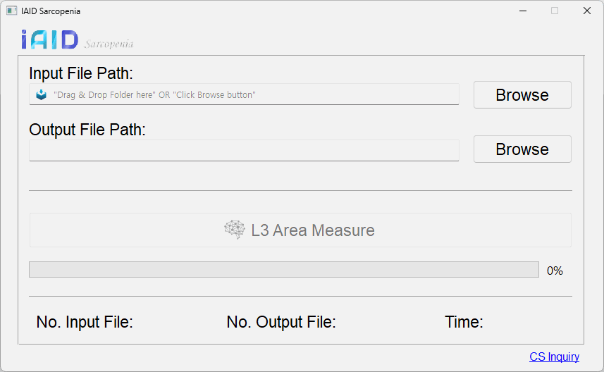

# PyQt_product

PyQt를 이용한 상품 GUI 생성
[](assets/process.gif)

## 적용 기술

제작 하며 발생한 이슈 위주로 정리

-   드래그 & 드랍: 파일 및 폴더 입력 편리
-   Thread 기술: QThread 도입으로 GUI 멈춤 해결
-   WYSIWYG: 해상도에 따른 폰트 모양 변경 해결
-   exe 파일 생성: pyinstaller를 이용한 설치 파일 생성
-   각종 편의성 및 에러 상황 고려

## 환경 설정

```
pip install PyQt6
pip install pyinstaller
```

## exe 생성

```bash
pyinstaller -w -i [ico 파일] [python 파일]
pyinstaller -w -i icon.ico main.py
```

-   pyinstaller 주요 option
    -   -w, --windowed, --noconsole
        -   console 창 숨기기
    -   -i --icon
        -   적용할 아이콘 <FILE.ico or FILE.exe,ID or FILE.icns or Image>
    -   -F, --onefile
        -   실행 가능한 하나의 파일로 제공
        -   시작 속도 느려지는 이슈로 사용 X
